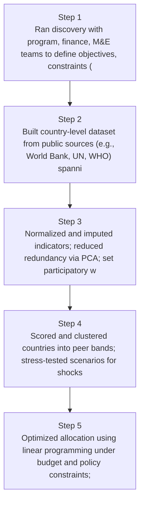
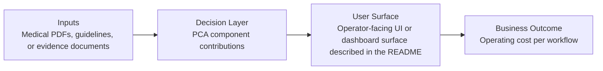
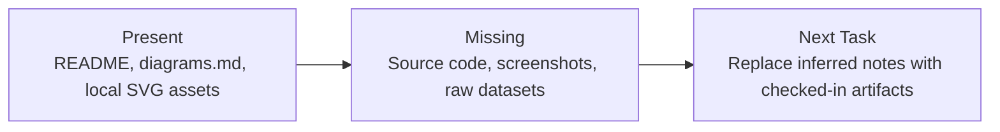

# Data-Driven Aid Allocation Model Diagrams

Generated on 2026-04-26T04:29:37Z from README narrative plus project blueprint requirements.

## Country scoring methodology

## PCA component contributions

## Evidence Gap Map

